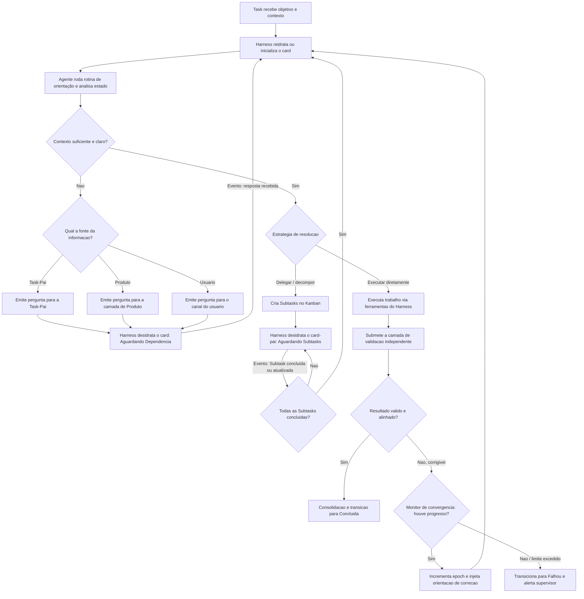
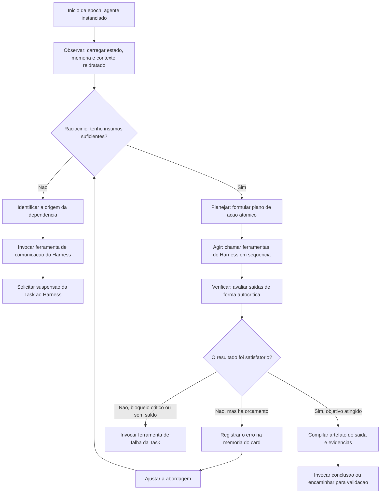

# Especificação Conceitual de Workflow: Swarm de Agentes para Kanban Agêntico de Long-Running

### Uma arquitetura para desenvolvimento de software autônomo fundamentada em Harness Engineering e Loop Engineering

> **Escopo deste documento.** Esta é uma especificação **conceitual**. Ela descreve *o que* o sistema faz e *por que* cada peça existe, deliberadamente omitindo *como* implementá-la (linguagens, bibliotecas, esquemas de dados, endpoints, scripts). O objetivo é o desenho do workflow, não o blueprint de engenharia.

---

## Sumário Executivo

Um **Swarm de Agentes Autônomos** opera sobre um **Kanban Agêntico** que funciona simultaneamente como interface visual para humanos e como **fonte única de verdade (Single Source of Truth, SSOT)** e motor de persistência do sistema. Cada card é uma unidade de computação — uma Task — que carrega seu próprio objetivo, contexto, histórico durável e estado de coordenação.

O sistema é projetado para **long-running**: tarefas de engenharia (refatorações amplas, migrações, construção de features de ponta a ponta) duram horas ou dias e não cabem em uma única janela de contexto. A premissa central, herdada da prática de engenharia de software com agentes, é que **os agentes trabalham em turnos**: cada sessão começa sem memória nativa do que veio antes, como uma equipe em que cada turno é coberto por um engenheiro diferente que chega sem lembrança do turno anterior. Toda a arquitetura existe para fazer o trabalho **progredir de forma coerente através dessas descontinuidades**.

Dois corpos de disciplina sustentam o desenho:

- **Harness Engineering** — o projeto do *substrato* que envolve o modelo: entrega de contexto, interfaces de ferramentas, artefatos de planejamento, laços de verificação, sistemas de memória e sandboxes. O harness é o que torna o trabalho do agente compreensível para humanos, comunicável entre sistemas e durável no tempo.
- **Loop Engineering** — o projeto dos *ciclos iterativos* de execução e convergência: como cada turno de raciocínio observa, planeja, age e verifica; como os turnos se encadeiam; e como o sistema decide parar.

---

## 1. Filosofia e Princípios de Design

### 1.1 A tese do Harness: o modelo é o motor, não o carro

O modelo de linguagem é o componente cognitivo — a peça que decide. Mas um motor potente não é um carro. Um carro precisa de direção, freios, faixas de rodagem, painel de avisos e a garantia de que as portas não cairão na estrada. O **Harness** é todo esse resto: a camada de controle e sustentação ao redor do modelo. Um motor excelente acoplado a um chassi mal projetado ainda produz um veículo perigoso.

Essa separação é o princípio organizador do sistema inteiro: **os agentes contêm a inteligência analítica e tomam decisões cognitivas; o Harness fornece as garantias operacionais, os limites e as barreiras físicas de segurança.**

### 1.2 O princípio das suposições que expiram

Todo componente de um harness codifica uma **suposição sobre algo que o modelo não consegue fazer sozinho**. Um artefato de progresso existe porque assumimos que o agente perderá o fio da meada entre sessões. Um avaliador independente existe porque assumimos que o gerador não criticará bem o próprio trabalho.

Essas suposições têm prazo de validade. À medida que os modelos melhoram, várias delas deixam de ser verdadeiras — e o componente correspondente passa de andaime útil a sobrecusto inerte. A consequência de design é dupla:

1. **Comece com o harness mais simples que funciona, e só adicione complexidade quando uma falha real a exigir.** Complexidade especulativa envelhece mal e esconde quais peças realmente sustentam o desempenho.
2. **Reavalie o harness periodicamente.** Quando um componente deixa de ser *load-bearing* (de carregar peso real no resultado), ele deve ser removido. O espaço de combinações interessantes de harness não encolhe quando os modelos melhoram — ele *se desloca*, e o trabalho contínuo é encontrar a próxima combinação útil.

Esse princípio deve ser tratado como uma propriedade viva do Swarm, não como uma decisão de projeto tomada uma única vez.

### 1.3 O Kanban como fonte única de verdade

O quadro não é decoração para humanos. Ele é o **ledger durável** do sistema. Toda a lógica de *gestão de contexto* vive no Harness, mas todo o *estado durável* vive no card. Essa divisão importa: o card garante durabilidade e consultabilidade; o Harness decide, a cada momento, qual fatia desse estado injetar no contexto do agente e como transformá-la para o modelo da geração atual. Como a estratégia de contexto pode mudar quando o modelo muda — mas o histórico durável não deve mudar — manter as duas coisas separadas é o que permite ao sistema evoluir sem reescrever sua memória.

### 1.4 Recursividade dinâmica: toda Subtask é uma Task

O Swarm é uma **árvore dinâmica de tarefas orientada a eventos**, com duas propriedades:

- **Toda Subtask é uma Task.** Qualquer subtarefa gerada por um agente herda integralmente as propriedades, proteções, loops e capacidades de uma tarefa principal. Não há uma classe inferior de "subtarefa" com menos garantias.
- **Topologia em árvore mutável e assimétrica.** Nós-filhos podem gerar nós-netos, suspender a execução de nós-pais de forma assíncrona e resolver dependências **sem bloquear recursos computacionais síncronos**. A árvore cresce e se reorganiza conforme o trabalho revela sua própria estrutura.

### 1.5 Desacoplar o cérebro das mãos

Três componentes são mantidos conceitualmente independentes para que cada um evolua sem arrastar os outros, à maneira de um sistema operacional que abstrai o hardware atrás de interfaces estáveis:

- **A sessão** (o raciocínio do agente em um turno) — efêmera.
- **O Harness** (orquestração, contexto, política) — a camada de controle.
- **O sandbox** (onde ferramentas efetivamente executam) — o ambiente isolado.

O modelo é o cérebro; as ferramentas no sandbox são as mãos. Trocar o modelo, mudar a estratégia de contexto ou endurecer o sandbox são mudanças que não deveriam exigir tocar nas outras camadas.

---

## 2. O Problema de Long-Running e os Modos de Falha Canônicos

### 2.1 A metáfora dos turnos

Janelas de contexto são finitas; projetos complexos não cabem em uma. Logo, o agente precisa de uma forma de **atravessar a fronteira entre sessões**. A imagem orientadora é a de uma obra coberta por engenheiros em turnos rotativos, cada um chegando sem memória do turno anterior. O que permite que a obra avance não é a memória de cada trabalhador, e sim a qualidade dos **artefatos que cada turno deixa para o próximo**: o registro do que foi feito, o estado limpo do código, a lista do que falta.

### 2.2 Os modos de falha que o sistema precisa neutralizar

A experiência com agentes de codificação de longa duração revela um conjunto recorrente de falhas. O harness existe, em grande medida, para neutralizar cada uma delas:

- **Tentar fazer tudo de uma vez (*one-shotting*).** O agente tenta resolver o projeto inteiro num único impulso, estoura o contexto no meio de uma feature e deixa o próximo turno com algo meio implementado e não documentado. O antídoto é o **trabalho incremental, uma feature de cada vez**, sobre uma especificação previamente decomposta.
- **Declarar vitória cedo demais.** Um agente posterior olha em volta, vê que houve progresso e conclui que a tarefa está pronta — quando não está. O antídoto é uma **especificação explícita e verificável de tudo o que "pronto" significa** (uma lista de critérios inicialmente todos marcados como *não atendidos*), contra a qual o progresso é medido.
- **Marcar como concluído sem verificação real.** O agente altera o código, talvez rode uma checagem superficial, e declara a feature pronta sem nunca exercê-la de ponta a ponta como um usuário faria. O antídoto é a **verificação comportamental obrigatória** por um agente que efetivamente opera a aplicação viva.
- **Ansiedade de contexto (*context anxiety*).** Ao se aproximar do que *acredita* ser seu limite de contexto, o modelo começa a encerrar o trabalho prematuramente, apressando-se para "fechar" antes do necessário. O antídoto envolve a estratégia de continuidade descrita na Seção 3 (em particular, dar ao agente um recomeço limpo quando apropriado).
- **Loops de estagnação.** O agente repete a mesma abordagem malsucedida, chamando ferramentas em círculo sem progresso real — o equivalente a um robô aspirador preso num canto. O antídoto é o **monitor de convergência** (Seção 5.3), que detecta a ausência de progresso e interrompe o ciclo.

### 2.3 Implicação de design

Nenhuma dessas falhas é resolvida tornando o modelo "mais inteligente" no prompt. Todas são resolvidas **projetando o sistema ao redor do modelo** para tornar a confiabilidade plausível: decompor o trabalho, externalizar o estado, separar quem executa de quem julga, e impor condições de parada claras.

---

## 3. Gestão de Estado e Continuidade

Esta é a área onde mais vale precisão conceitual, porque três mecanismos distintos costumam ser confundidos sob o rótulo genérico de "memória". O sistema usa os três, em situações diferentes, com trade-offs diferentes.

### 3.1 Compaction (compactação em sessão)

Quando o contexto de uma sessão *ativa* se enche, a conversa anterior é **resumida no próprio lugar** e o **mesmo agente** continua a partir de um histórico encurtado. A continuidade é preservada, mas há um custo: a compactação toma uma **decisão irreversível sobre o que descartar**, e é difícil saber de antemão quais tokens os turnos futuros precisariam. Resumos demais ou mal-feitos degradam silenciosamente o raciocínio (o chamado *context drift*). Além disso, a compactação não dá ao agente uma "folha em branco" — a ansiedade de contexto pode persistir, porque o agente continua sendo o mesmo, ciente de que já está operando sobre um resumo.

### 3.2 Context Reset com Handoff (reinício com transferência)

A alternativa é **limpar a janela inteira e instanciar um agente novo**, acompanhado de um **artefato de transferência estruturado** que carrega o estado relevante e os próximos passos. Isso dá ao novo agente uma folha verdadeiramente em branco — o que elimina a ansiedade de contexto — ao custo de exigir que o artefato de handoff seja bom o bastante para que o sucessor retome o trabalho sem reconstruir tudo. O reset adiciona complexidade de orquestração, sobrecusto de tokens e latência a cada troca, então é usado quando a ansiedade de contexto ou a perda de coerência justificam o custo.

> **Nota de evolução.** A necessidade de resets depende fortemente do modelo. Gerações que sofrem de ansiedade de contexto tornam o reset essencial; gerações mais capazes, que sustentam tarefas longas nativamente, podem dispensá-lo. Esta é uma aplicação direta do princípio das suposições que expiram (1.2): o reset é um andaime cuja necessidade deve ser reavaliada a cada novo modelo.

### 3.3 Ledger Durável e Reidratação Seletiva (o coração do long-running)

A estratégia mais robusta, e a que define o caráter deste sistema, **defere a decisão irreversível**. Em vez de resumir e descartar, o sistema **registra tudo num log durável e consultável que vive fora da janela de contexto** — concretamente, no card do Kanban e em seu histórico de eventos. A cada turno, o Harness **consulta a fatia desse log que importa agora**, aplica a transformação adequada ao modelo da vez e injeta o resultado no contexto do agente, **sem nunca tocar no log durável**.

É aqui que os termos **desidratação** e **reidratação** ganham seu significado preciso — e onde corrigimos uma confusão comum:

- **Desidratar** *não* significa congelar um processo vivo do agente e guardá-lo. Significa **externalizar o estado para o ledger durável e liberar o worker**, encerrando-o e devolvendo seus recursos. O agente desaparece; o estado permanece no card.
- **Reidratar** significa **instanciar um worker novo que reconstrói seu contexto de trabalho a partir do ledger**, puxando apenas a fatia de alto sinal de que precisa para o próximo passo.

Um padrão útil para pensar nisso é o de **memória indexada**: o que fica no contexto de trabalho do agente é um **resumo compacto com referências estáveis** (índices); os artefatos completos — saídas de ferramentas, evidências, histórico detalhado — ficam arquivados no ledger sob esses índices. Quando um resultado específico do passado volta a ser relevante, o agente **dereferencia o índice** e recupera o conteúdo exato, reinjetando-o no contexto. Assim, o sistema separa um **contexto de trabalho enxuto** de um **arquivo durável de fidelidade total**, e nenhuma decisão de descarte é tomada cedo demais.

O princípio que rege qualquer uma dessas operações é o de **tratar o contexto como recurso precioso e finito**: a cada passo, busca-se o **menor conjunto de tokens de alto sinal** que maximiza a chance do resultado desejado.

### 3.4 Roteamento de estratégia dependente de estado

As três técnicas acima não são mutuamente exclusivas nem aplicadas de modo fixo. A gestão de contexto é melhor tratada como um **problema de roteamento dependente de estado**: o Harness escolhe dinamicamente *qual* estratégia usar conforme a situação do card (executando ativamente, aguardando dependência, retomando após dias), em vez de aplicar a mesma operação durante toda a trajetória. Um corolário disso é a **pré-compactação**: antes de uma operação cara ou de uma alteração ampla, o Harness produz uma visão compacta do "conjunto de trabalho" (*working set*) do estado atual, reduzindo regressões e mantendo a localidade da edição.

### 3.5 Artefatos de continuidade

Independentemente do mecanismo, a continuidade entre turnos depende de um pequeno conjunto de **artefatos duráveis** que qualquer worker novo consulta ao assumir o card. Conceitualmente (sem prescrever formato):

- **A especificação de escopo** — a decomposição do objetivo em uma lista verificável de capacidades a entregar, inicialmente toda marcada como *não atendida*. É o antídoto contra a declaração prematura de vitória.
- **O registro de progresso** — a narrativa concisa e estruturada do que turnos anteriores fizeram, decidiram e descobriram.
- **O histórico versionado do trabalho** — a trilha de mudanças que permite reverter para estados sãos e entender a evolução do artefato.
- **O procedimento de retomada do ambiente** — o conhecimento de como colocar o ambiente de trabalho em pé e exercê-lo num teste básico antes de prosseguir.

### 3.6 Idempotência, checkpoints, epochs e heartbeats

Quatro garantias operacionais tornam o long-running seguro diante de instabilidades:

- **Checkpointing.** Cada micro-ciclo do agente registra pontos de progresso. Se a execução falhar por instabilidade de infraestrutura ou timeout, o Harness retoma a partir do último checkpoint válido em vez do início.
- **Idempotência.** Ações com efeitos colaterais externos (criar um repositório, registrar uma mudança) usam chaves de idempotência, de modo que uma retomada após falha não duplique o efeito.
- **Epochs.** Execuções longas são divididas em *epochs* — turnos discretos de raciocínio e ação. A epoch é a unidade natural de checkpoint, de medição e de decisão sobre continuar ou parar.
- **Heartbeats.** Entre epochs, o Harness emite sinais de status para o Kanban, atualizando métricas de consumo (tokens, custo acumulado, tempo decorrido) e mantendo a telemetria do sistema observável em tempo real.

---

## 4. Estados Conceituais da Task

O ciclo de vida expande o modelo clássico do Kanban para acomodar a natureza reidratável e orientada a eventos dos agentes.

| Estado | Significado operacional | Gatilho de transição |
| --- | --- | --- |
| **Backlog** | A Task foi criada e seu escopo inicial instanciado, mas aguarda priorização ou alocação de recursos. | Criação manual ou por uma Task-Pai. |
| **Aguardando Execução** | Pronta para rodar; aguarda uma janela de execução livre no Harness. | Priorização no Kanban. |
| **Em Execução** | Um agente processa ativamente a Task dentro de uma epoch. | Alocação de worker pelo Harness. |
| **Aguardando Dependência** *(estado desidratado)* | A execução foi suspensa e o estado externalizado para o card. A Task aguarda uma Subtask, um stakeholder humano ou um evento externo. | Chamada de ferramenta de bloqueio ou de pergunta. |
| **Em Revisão / Validação** | O trabalho técnico foi produzido; o card entra nos laços de avaliação independente (QA e Code Review). | Conclusão do plano de trabalho pelo executor. |
| **Concluída** | O objetivo foi atingido, validado contra os critérios de aceite e consolidado. Estado terminal de sucesso. | Aprovação em todas as camadas de validação. |
| **Falhou** | A Task esgotou as tentativas de autocorreção, estourou um teto de governança ou encontrou um bloqueio intransponível. Estado terminal de erro. | Exaustão das políticas de recuperação. |
| **Suspensa por Timeout** | Uma dependência humana não respondeu dentro do prazo de governança; o card é estacionado para liberar priorização. | Estouro do prazo de resposta humana. |
| **Cancelada** | Interrompida externamente, por intervenção humana ou cancelamento em cascata da Task-Pai. Estado terminal. | Comando de aborto. |

---

## 5. Loop Macro: o Loop Universal da Task

O Loop Macro governa a jornada de qualquer card. Ele é o ciclo de alto nível dentro do qual os turnos individuais (Loop Micro, Seção 6) acontecem.

### 5.1 Rotina de orientação (ganhar contexto ao assumir o card)

Todo agente, ao iniciar um turno sobre um card, executa uma **rotina de orientação** antes de qualquer trabalho novo. Conceitualmente: identificar o ambiente em que opera, ler o registro de progresso e o histórico para entender o que foi feito recentemente, consultar a especificação de escopo para escolher o próximo item de maior prioridade ainda não atendido, e **exercer o estado atual num teste básico** para detectar se o ambiente foi deixado quebrado. Essa rotina é barata e evita o desperdício de começar a construir sobre uma base já defeituosa.

### 5.2 As três estratégias de resolução

Diante de um card com contexto suficiente, o agente escolhe entre:

1. **Delegar / decompor** — quebrar o problema em Subtasks (que são, elas próprias, Tasks completas) e suspender o card-pai até que retornem.
2. **Executar diretamente** — realizar o trabalho com as ferramentas do Harness e submetê-lo à validação independente.
3. **Buscar informação** — quando o contexto é insuficiente, emitir uma pergunta para a fonte correta e desidratar (Seção 9).

### 5.3 Monitor de convergência

Para evitar desperdício em loops de estagnação, o Harness compara os resultados entre epochs consecutivas, em nível semântico e sintático. Se a **magnitude da mudança** entre duas iterações sucessivas — na estratégia proposta ou no artefato produzido — cair abaixo de um limiar de convergência, o ciclo é considerado estagnado e quebrado, e o card transita para **Falhou**, exigindo intervenção humana.

> Condição de estagnação (conceitual):
> **Δ(iteração\_n, iteração\_n−1) < θ\_convergência ⟹ interrupção por estagnação.**

A intuição é distinguir *iteração produtiva* (cada tentativa muda a abordagem de forma significativa em resposta ao feedback) de *iteração circular* (a mesma abordagem malsucedida repetida com variações triviais). Apenas a segunda é interrompida.

---

## 6. Loop Micro: o Ciclo Interno de um Turno

Cada epoch de qualquer agente segue um ciclo estruturado de quatro movimentos — **observar, planejar, agir, verificar** — com autocrítica explícita antes de declarar sucesso.

### A separação de papéis dentro do loop

O Loop Micro só é confiável porque as responsabilidades estão separadas em camadas, no espírito de "desenrolar o loop":

- **O modelo decide** — escolhe qual ação tomar e formula seus argumentos.
- **O Harness valida** — checa a ação contra políticas e permissões antes de executá-la.
- **O sandbox restringe** — executa a ferramenta isolada, com inputs sanitizados e limites de tempo.

As ferramentas, idealmente, são **previsíveis e determinísticas**: o componente criativo e ambíguo vive no modelo, não na ferramenta. Quanto mais "entediante" e confiável a ferramenta, mais controlável o sistema.

---

## 7. Harness Engineering: Matriz de Responsabilidades

A regra geral: **o agente decide; o Harness garante.** A tabela detalha a divisão por função.

| Função | Responsabilidade do Agente (o que decide) | Responsabilidade do Harness (o que garante) |
| --- | --- | --- |
| **Gestão de memória** | Selecionar quais informações do histórico são relevantes para a resposta técnica atual. | Manter o ledger durável e consultável; decidir qual fatia injetar e como transformá-la para o modelo da vez; aplicar compactação, trimming ou reidratação por índice conforme o estado. |
| **Uso de ferramentas** | Decidir qual ferramenta chamar e formular os argumentos. | Executar a ferramenta em sandbox isolado, sanitizar inputs, impor timeouts e capturar logs de erro. |
| **Ciclo de vida da Task** | Declarar a necessidade de criar Subtasks para um problema complexo. | Instanciar os cards de Subtask, injetar metadados de rastreabilidade, gerir os eventos de retorno e bloquear/desbloquear cards conforme a hierarquia. |
| **Gestão de custo** | Otimizar o tamanho das respostas para focar no escopo solicitado. | Contabilizar tokens, calcular custo acumulado em tempo real por card e abortar a execução ao ultrapassar o teto financeiro. |
| **Comunicação com humanos** | Formular a pergunta de negócio ou técnica de forma clara e estruturada. | Roteá-la ao canal correto, pausar a execução, desidratar o contexto e monitorar o input humano para reativar o agente. |
| **Continuidade entre sessões** | Deixar um registro claro do que foi feito e do que falta. | Garantir que os artefatos de continuidade sejam persistidos e que o próximo worker os encontre ao reidratar. |

A linha de fundo conceitual: **a lógica de gestão de contexto pertence ao Harness, não à sessão.** A sessão é efêmera e ingênua; o Harness é durável e estratégico.

---

## 8. Topologia do Swarm: Padrão Estrutural e Papéis

### 8.1 O padrão estrutural por trás dos papéis

Por baixo da variedade de papéis especializados, há um **padrão estrutural** simples e recorrente, inspirado na ideia de separar quem produz de quem julga (uma dinâmica do tipo gerador–avaliador):

- **Orquestração** — decompõe o objetivo, governa o orçamento e consolida o resultado.
- **Especificação / planejamento** — expande objetivos curtos em escopo verificável e define contratos técnicos e de negócio, deliberadamente **sem** sobre-especificar detalhes de implementação cedo demais (erros numa especificação granular prematura se propagam em cascata para baixo).
- **Geração** — produz o artefato (o código), trabalhando de forma incremental.
- **Avaliação** — exerce o artefato e o julga contra critérios concretos, **separada de quem o produziu**.

Os papéis abaixo são instâncias especializadas dessas quatro funções.

### 8.2 O princípio do avaliador independente

Este é um dos achados mais sólidos da prática de agentes e um pilar do sistema: **agentes tendem a elogiar o próprio trabalho**, mesmo quando a qualidade é medíocre para um observador humano. Pedir a um agente que avalie o que ele mesmo produziu produz, de forma confiável, um viés positivo. Isso é especialmente agudo em tarefas subjetivas (design), mas aparece também em tarefas verificáveis, onde o agente identifica um problema legítimo e então se convence de que "não é grave" e aprova mesmo assim.

A alavanca eficaz não é tentar fazer o gerador se autocriticar melhor — isso é difícil. É **separar o executor do avaliador** e **calibrar um avaliador independente para ser cético**. Tornar um avaliador isolado mais rigoroso é muito mais tratável do que tornar um gerador crítico de si mesmo; e, uma vez que esse feedback externo existe, o gerador passa a ter algo concreto contra o qual iterar.

Critérios subjetivos ("este design é bom?") são convertidos em **critérios gradáveis concretos** ("este design segue nossos princípios de design?"), com limiares duros: se qualquer critério cai abaixo do seu limiar, a entrega falha e o gerador recebe feedback específico e acionável sobre o que corrigir.

> **Aplicação de governança:** o avaliador independente tem custo, e seu valor depende de quão distante a tarefa está do que o modelo faz com confiança sozinho. Para tarefas dentro da zona de competência nativa do modelo, ele pode virar sobrecusto; para tarefas no limite ou além dele, ele dá ganho real. A decisão de quão pesada deve ser a camada de avaliação é, portanto, dependente do modelo e da dificuldade — outro caso do princípio 1.2.

### 8.3 Catálogo de papéis

Cada agente opera dentro de um perfil cognitivo restrito por seu prompt de sistema e pelas ferramentas que o Harness lhe disponibiliza. Eles cooperam transitando cards pelas colunas do Kanban.

**Manager** *(orquestração)*
Lê o objetivo macro, decompõe em Subtasks acionáveis atribuídas a papéis especializados, gere conflitos de fluxo, governa o orçamento, consolida as entregas e aprova a transição para estados terminais.
*Não deve:* escrever código, definir regras de negócio por conta própria ou atropelar as validações de QA e Code Review.

**Produto** *(especificação de negócio)*
Guardião do valor de negócio, do escopo funcional e dos critérios de aceite. Resolve ambiguidades funcionais, mapeia caminhos de exceção de negócio, descreve cenários de teste em linguagem natural e valida se a solução atende à dor do usuário.
*Não deve:* tomar decisões de infraestrutura ou arquitetura, nem ditar escolhas de design de código.

**Architecture** *(especificação técnica)*
Governança técnica: design de sistemas, modularidade, performance e segurança estrutural. Define contratos entre componentes, mapeia impactos no que já existe, escolhe padrões apropriados e estabelece os limites técnicos do escopo para evitar *overengineering*.
*Não deve:* alterar a lógica funcional definida por Produto, nem implementar o código final.

**Engineer** *(geração)*
Escrita de código-fonte, criação de testes e refatoração sob demanda, seguindo estritamente as diretrizes de Architecture. Garante código limpo e legível, escreve testes que comprovam a eficácia da mudança e **autoavalia o próprio trabalho antes de entregá-lo** à validação — mas essa autoavaliação não substitui a validação independente.
*Não deve:* interagir com canais de usuários externos, adicionar dependências arquiteturais sem autorização ou assumir comportamentos não documentados.

**QA (Quality Assurance)** *(avaliação comportamental)*
Validação comportamental, testes de regressão e garantia dos critérios de aceite. **Exerce a aplicação viva em sandbox como um usuário faria** — clicando pela interface, testando endpoints e estados — em vez de inspecionar apenas o código estático. Gera relatórios de reprodução de bugs com os passos exatos e reprova entregas que divergem do especificado.
*Não deve:* corrigir o código (apenas aponta falhas), nem decidir se uma feature é necessária (papel de Produto).

**Code Reviewer** *(avaliação estática)*
Análise estática, manutenibilidade, segurança e aderência a guias de estilo. Analisa as mudanças, detecta duplicações e vulnerabilidades, verifica cobertura de testes e sugere melhorias de performance.
*Não deve:* reprovar por preferências estéticas subjetivas não parametrizadas, nem reescrever o código revisado.

**Generic** *(apoio operacional)*
Apoio generalista de baixa complexidade cognitiva: formatação de documentação, tradução de strings de internacionalização, limpeza de logs, ajustes tipográficos.
*Não deve:* tomar decisões de arquitetura, negócio ou engenharia pesada, nem criar Subtasks autônomas sem supervisão de um Manager.

---

## 9. Comunicação, Contratos e Resolução de Deadlocks

### 9.1 O contrato de Task: acordar "pronto" antes de começar

Como a especificação de escopo é deliberadamente de alto nível, há uma lacuna entre "histórias de usuário" e "implementação testável". O sistema fecha essa lacuna com um **contrato de Task**, negociado **antes** de qualquer trabalho começar: o executor propõe o que vai construir e como o sucesso será verificado; o avaliador revisa essa proposta para garantir que se está construindo a coisa certa; os dois iteram até concordar. Só então o executor constrói, fiel ao contrato acordado. Isso mantém o trabalho alinhado ao escopo sem sobre-especificar a implementação cedo demais.

### 9.2 O risco de deadlock Pai–Filho

Em sistemas recursivos de múltiplos agentes, há um deadlock real: o card-pai entra em espera aguardando o card-filho concluir, enquanto o card-filho entra em espera enviando uma pergunta de esclarecimento ao card-pai. Ambos param, cada um esperando o outro.

### 9.3 Protocolo não-bloqueante orientado a eventos

Para eliminar deadlocks, a arquitetura **proíbe a espera síncrona em nível de thread**. A comunicação adota um modelo de **atores orientados a eventos através do ledger do Kanban** — agentes não "seguram a linha" esperando; eles escrevem no ledger, são desligados, e são reativados por eventos. O fluxo:

1. **Ativação por interrupção.** Quando um card-filho faz uma pergunta ao pai, o Harness move o filho para *Aguardando Dependência*.
2. **Despertar assíncrono do pai.** O Harness reativa o card-pai num **escopo isolado de resposta**, injetando a pergunta no topo do seu contexto de trabalho.
3. **Escopo isolado.** O pai acorda **apenas para responder à pergunta** — ele não reavalia se sua tarefa global terminou. Executa um sub-turno de esclarecimento e nada mais.
4. **Cadeias de escalonamento limpas.** Se o pai não souber, ele repete o processo recursivamente para cima (pergunta ao *seu* pai, ou escala para Produto/Usuário). O fluxo se propaga em cascata **sem empilhar threads ativas**.
5. **Retorno ao repouso.** Quando o pai responde, o Harness grava a resposta no card-filho, devolve o filho para *Aguardando Execução* e o pai para o estado desidratado de onde veio.

A propriedade-chave: a comunicação acontece via **ledger durável e eventos**, nunca via conexões abertas. Nenhum agente bloqueia recursos enquanto espera.

---

## 10. Condições de Parada e Governança de Long-Running

Operar com segurança por horas exige **condições de parada explícitas** que interrompam a execução de forma limpa. Os valores abaixo são **parâmetros de governança configuráveis**, apresentados como ilustração — não como prescrições.

1. **Concluída (sucesso).** O objetivo foi integralmente cumprido, validado de forma independente e o artefato integrado ao destino principal. (Detalhado na Seção 11.)
2. **Falhou (exaustão de tentativas).** O agente tentou corrigir um erro técnico por um número configurado de vezes sem alteração no resultado prático.
3. **Falhou (estagnação).** O monitor de convergência detectou ausência de progresso entre epochs (Seção 5.3).
4. **Limite de profundidade da árvore.** Para evitar ramificação exponencial e loops lógicos ocultos, a cadeia de descendência (Pai → Filho → Neto…) é limitada a uma profundidade máxima configurada; além dela, o Harness recusa a criação de novos nós.
5. **Tetos financeiros e temporais (*hard ceilings*).** Cada card carrega um teto de custo e um teto de tempo de computação ativa acumulada. Atingir qualquer um suspende a execução imediatamente e move o card para atenção/falha. Tetos são essenciais porque o custo de uma execução autônoma cresce a cada turno.
6. **Timeout de intervenção humana.** Quando uma dúvida é enviada a um humano, o card permanece desidratado. Se o humano não responder dentro do prazo de governança, o card é movido para *Suspensa por Timeout*, liberando priorização no Kanban.

A filosofia comum a todas: **falhar de forma limpa e observável é preferível a falhar de forma cara e silenciosa.**

---

## 11. Definição de Conclusão (Definition of Done)

Um card só pode ser transicionado para **Concluída** quando preencher, cumulativamente, os seguintes critérios — geridos pelo Harness e aprovados pela orquestração:

- **Atendimento total do objetivo.** A saída atende a todos os requisitos do card original, validados pela camada de especificação.
- **Aprovação dupla e independente.** O trabalho passou, sem ressalvas, pelo crivo do avaliador comportamental (QA) **e** do avaliador estático (Code Reviewer), em ambientes segregados e separados de quem o produziu.
- **Ausência de regressões.** A suíte completa de testes existentes foi executada e nenhum teste previamente estável quebrou.
- **Fechamento da árvore.** Todas as Subtasks criadas a partir deste card foram resolvidas e estão *Concluídas*. Um card-pai não fecha com filhos em aberto.
- **Consolidação de memória.** Um resumo estruturado das lições aprendidas e das mudanças efetuadas foi gravado na memória durável do projeto, para orientar execuções futuras do Swarm.
- **Sanidade orçamentária.** A execução encerrou dentro das margens de custo e de token estipuladas.

---

## 12. Cenários de Workflow Recomendados

O Swarm não é engessado: o Manager altera dinamicamente a rota do card pelas colunas de execução conforme a complexidade e a natureza da demanda. Três rotas ilustrativas:

**Cenário A — Task técnica de alta complexidade** (ex.: alteração de arquitetura core)
Manager → Architecture (desenho e contratos) → Produto (validação de impacto) → Engineer (implementação e testes) → Code Reviewer (análise estática) → QA (regressão e carga) → Manager (consolidação e fechamento).

**Cenário B — Correção de bug funcional urgente** (ex.: erro em regra de desconto)
Manager → Produto (definição do critério de aceite correto) → Engineer (correção) → QA (validação do caso de borda especificado) → Manager (integração e fechamento).

**Cenário C — Documentação e débito técnico leve**
Manager → Generic (atualização de manuais) → Code Reviewer (revisão e lint) → Manager (fechamento).

A regra implícita: rotas mais arriscadas atravessam mais camadas de especificação e de avaliação independente; rotas triviais atravessam menos. A profundidade de processo é proporcional ao risco.

---

## 13. Princípios-Chave em Síntese

1. **O modelo é o motor; o Harness é o carro.** A inteligência decide; o substrato garante, limita e sustenta.
2. **Todo componente de harness expira.** Comece simples, reavalie a cada modelo, e remova o que deixou de carregar peso.
3. **Agentes trabalham em turnos.** O que faz o trabalho avançar não é a memória de cada turno, mas a qualidade dos artefatos duráveis que cada turno deixa.
4. **O estado vive no ledger, não no processo.** Desidratar é externalizar e liberar; reidratar é reconstruir a fatia mínima de alto sinal a partir do ledger durável.
5. **Trate o contexto como recurso finito.** Busque sempre o menor conjunto de tokens de alto sinal; defira decisões irreversíveis de descarte sempre que possível.
6. **Separe quem executa de quem julga.** Um avaliador independente e cético é a alavanca mais eficaz contra o viés de autoelogio.
7. **Acorde "pronto" antes de começar.** Contratos negociados e listas verificáveis de escopo neutralizam tanto a sobre-especificação prematura quanto a declaração precoce de vitória.
8. **Verifique exercendo, não inspecionando.** Uma feature só está pronta quando foi operada de ponta a ponta como um usuário a operaria.
9. **Comunique-se por eventos, nunca por espera síncrona.** O ledger orientado a eventos é o que torna a recursão livre de deadlocks.
10. **Pare de forma limpa.** Tetos de custo, tempo, profundidade e estagnação tornam o long-running seguro: falha observável é melhor que falha cara e silenciosa.

---

## Fontes e Leituras de Referência

Os conceitos de harness e loop engineering aplicados acima sintetizam material público recente, em especial:

- Anthropic — *Effective harnesses for long-running agents* (os modos de falha canônicos, a metáfora dos turnos, os artefatos de continuidade).
- Anthropic — *Harness design for long-running application development* (o padrão gerador–avaliador, contratos de sprint, compactação vs. reset de contexto, ansiedade de contexto, o princípio das suposições que expiram).
- Anthropic — *Effective context engineering for AI agents* e *Scaling Managed Agents: decoupling the brain from the hands* (o ledger durável e consultável, a separação entre sessão/harness/sandbox, "a lógica de contexto pertence ao harness").
- OpenAI — *Unrolling the Codex agent loop* e *Run long-horizon tasks with Codex* (desenrolar o loop em camadas, compactação por limiar, ferramentas determinísticas, rotina de "done when").
- Literatura recente sobre memória indexada e roteamento de contexto dependente de estado (reidratação por índice; seleção dinâmica de estratégia de compactação ao longo da trajetória).
