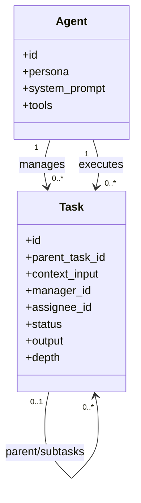
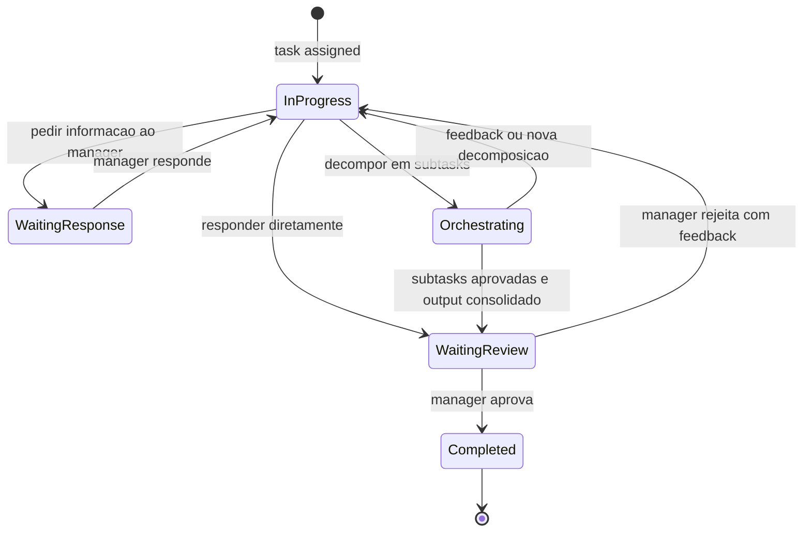
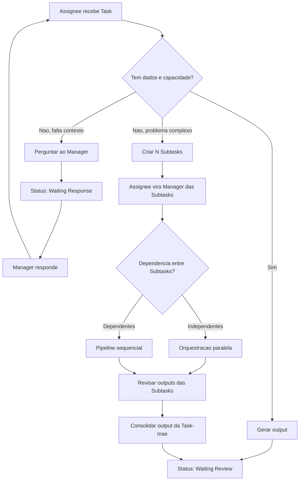
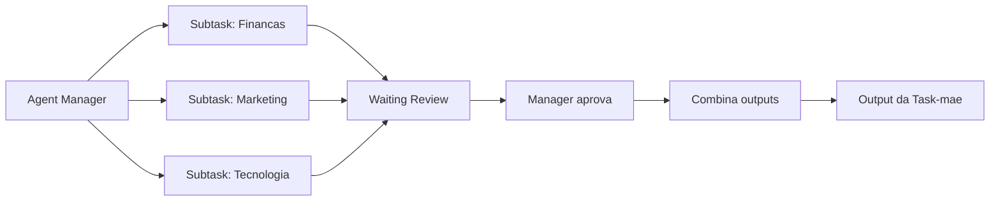
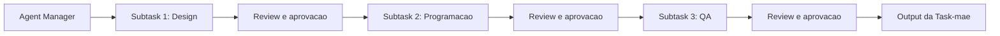
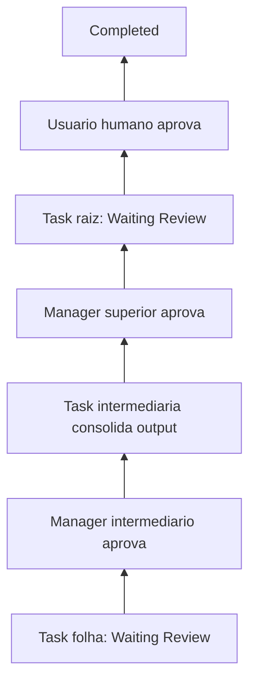
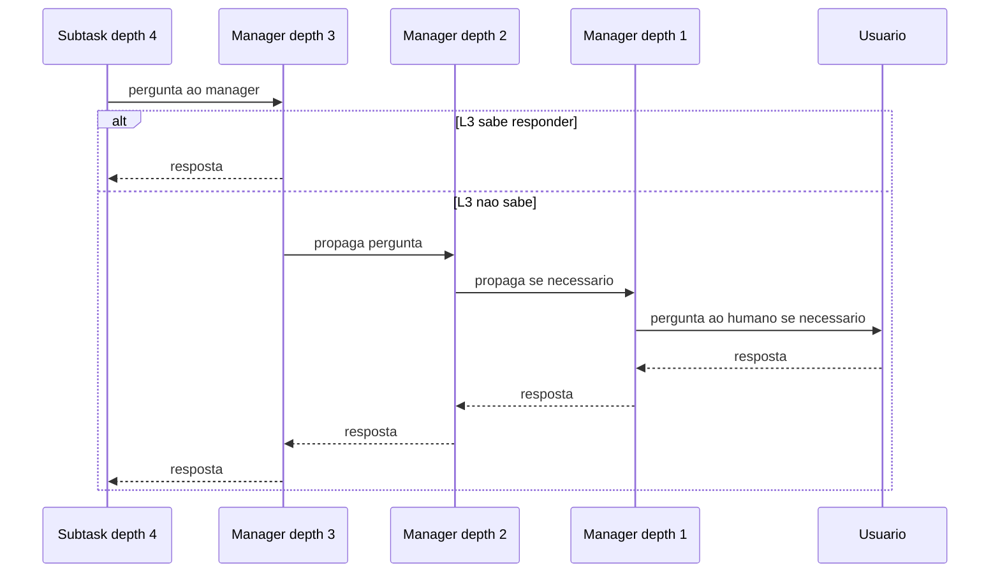
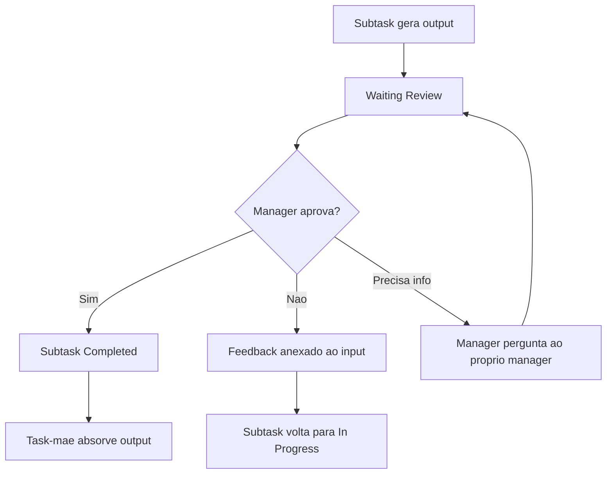
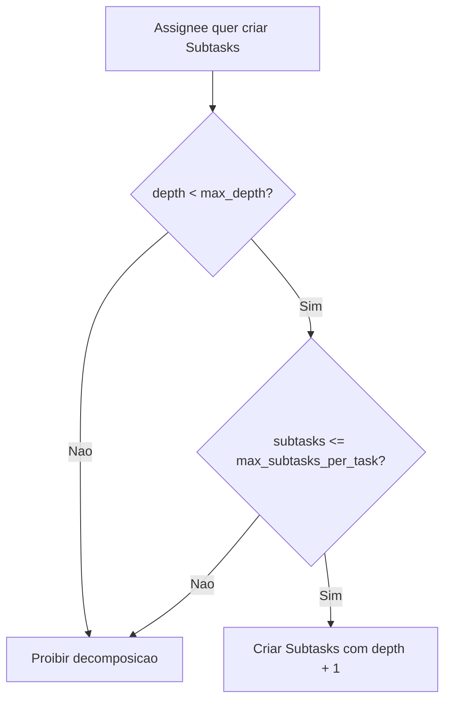

# Agent Workflow: Enxame Hierarquico e Recursivo

Este documento descreve o workflow de agentes no modelo de Recursive Swarm. A regra central e que Task e Subtask sao a mesma entidade: uma Subtask e apenas uma Task com `parent_task_id`.

## Modelo Recursivo

## Maquina de Estados

## Decisao do Assignee

## Orquestracao Paralela

## Orquestracao Sequencial

## Encerramento Recursivo

## Perguntas e Respostas

Subtasks nao perguntam diretamente ao usuario humano. Uma Task sempre pergunta ao seu `manager_id`.

Se o manager souber responder, ele responde e a Task volta para `In Progress`. Se o manager tambem depender de informacao externa, ele transforma a duvida em uma pergunta para o proprio manager. A pergunta sobe pela arvore ate encontrar um agent que saiba responder ou ate chegar na Task raiz. Apenas o manager da Task raiz pergunta ao usuario humano.

Quando a resposta chega, ela desce pela mesma cadeia de correlacao da pergunta ate a Task que estava bloqueada.

Mesmo no ultimo nivel (`depth = 4`), a Task pode pedir informacao ao manager. O limite de profundidade bloqueia apenas nova decomposicao em subtasks, nao bloqueia perguntas.

## Review e Resposta de Subtask

O manager de uma subtask e o assignee da Task-mae. Quando uma subtask entrega output, ela entra em `Waiting Review` para esse manager.

- Se o manager aprova, a subtask vira `Completed` e o output fica disponivel para a Task-mae.
- Se o manager rejeita, ele anexa feedback objetivo ao input da subtask e ela volta para `In Progress` com o mesmo assignee.
- Se o manager precisa de mais dados para revisar, ele usa o fluxo de perguntas e respostas acima.
- Quando todas as subtasks diretas estao `Completed`, a Task-mae volta para `In Progress` para consolidar os outputs.

## Limites de Controle

Para evitar que o enxame saia de controle, a primeira versao usa limite hard-coded de profundidade e nao usa limiter de budget:

- `MAX_DEPTH = 4`: profundidade maxima da arvore de Tasks.
- `max_subtasks_per_task`: limite de fan-out por Task, quando necessario.
- Sem `token_budget` e sem `cost_budget` nesta versao.
- Escalada para usuario humano acontece apenas por pergunta da Task raiz.

Regra recomendada inicial:

Valores iniciais sugeridos:

- `MAX_DEPTH`: 4.
- `max_subtasks_per_task`: 5.
- Ao atingir `depth = 4`, a Task pode responder, pedir informacao ou entregar output para review, mas nao pode criar subtasks.
