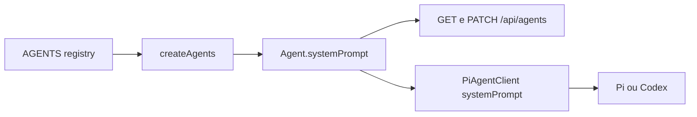

# Agentes

## Responsabilidade

Manter o mapa das personas executoras e de como suas instruções especializadas chegam ao `systemPrompt` de cada run.

## Componentes

- [Manager](./MANAGER.md)
- [Produto](./PRODUTO.md)
- [Architecture](./ARCHITECTURE.md)
- [Engineer](./ENGINEER.md)
- [Code Reviewer](./CODE_REVIEWER.md)
- [QA](./QA.md)
- [Generic](./GENERIC.md)
- [API](./API.md)

## Relações

O `role` mantém a descrição curta. O `systemPrompt` contém a instrução especializada; o `PiAgentClient` acrescenta guardrails, regras de orquestração ou execução e o contrato JSON comum. Agents sem `systemPrompt` usam `role` como fallback.

## Fontes no codigo

- `src/infrastructure/agents/index.ts`
- `src/domain/agent.ts`
- `src/cli/orquestrator-factory.ts`
- `src/application/pi-client.ts`
- `src/infrastructure/api/routes/agents.ts`
