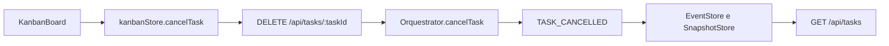

# Tasks

## Responsabilidade

Mapear o ciclo de vida persistido das tasks e suas ações explícitas de usuário.

## Componentes

- [Ciclo de vida](./LIFECYCLE.md)

## Relações

## Fontes no codigo

- `web/src/components/kanban/KanbanBoard.tsx`
- `web/src/stores/kanbanStore.ts`
- `src/infrastructure/api/routes/tasks.ts`
- `src/application/orquestrator.ts`
